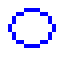
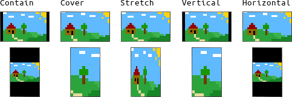

# Draw16

Draw16 is a fast graphic engine for retro games with very low screen resolution. It is made for games like from the **Super Nintendo** (Super Famicom) or **DOS** era that use a 16 pixel grid. Draw16 is based on JavaScript and WebGL. The core is written in C++ and SDL, translated with emscripten.

## Why should I use it?

It is free, fast, simple and pixel perfect. Many modern game engines lack the ability of pixel precise drawing that is needed for retro games. Finding workarounds in order to get these graphics often results in performance issues.

Draw16 draws pixels, text, lines, rectangles, ellipses and chips (16x16 pixel textures). It supports full transparency for shadows, weather or water effects.

## Contents

[Getting started](#getting-started)  
- [Get the code](#get-the-code)  
- [The main structure](#the-main-structure)  
[Performance](#performance)  
[Function overview](#function-overview)  
- [Colors](#colors)  
- [Color drawing functions](#color-drawing-functions)  
- [Textures](#textures)  
- [Texture drawing functions](#texture-drawing-functions)  
- [Text](#text)  
- [Text drawing functions](#text-drawing-functions)  
- [Setup functions](#setup-functions)  
- [Parameters](#parameters)  
[Fullscreen mode](#fullscreen-mode)  
[HTML mix mode](#html-mix-mode)  
[RPG Maker resources](#rpg-maker-resources)  
[Limits](#limits)  
[Feedback](#feedback)  

## Getting started

### Get the code

Download or clone the git repository and run the demos:

    git clone https://github.com/philipp-schwarz/draw16.git

Use Firefox for development. Or Chrome with the parameter --allow-file-access-from-files. Or use a webserver. Maybe... just use Firefox.

To get started quickly select a demo and edit it to your needs. Playing with functions and parameters might be easier than to read the whole documentation.

### The main structure

The library needs to be loaded inside of the ```<body>``` tag:

    <script src="../lib/Draw16.js"></script>

Init functions set up everything we need:

	Draw16.init(256, 240);
	Draw16.installFullscreen();

A callback function is called on every redraw:

	Draw16.onStep = function() {
		// Your application code goes here
	}

See *template.html* for a complete example.

## Performance

If you use Draw16 wrong you will suffer with poor performance. There is no need to read the whole documentation, but you should read this. Always take care of the transparency in your chips / textures. This is key.

  
**No transparency - super fast**  
Chips without transparency get a special boost and are drawn super fast. Make sure that not a single pixel in your sprite has transparency set, not even 1%!

  
**Full transparency - still fast**  
When your sprite uses only full or no transparency, Draw16 still performs very well. Make sure to use only no (0%) or full (100%) transparency.

  
**50% transparency - okay**  
When a pixel has 50% transparency set (alpha 127/128) it will be processed faster, but not super fast.

  
**25% or 75% transparency - still okay**  
When a pixel has 25% or 75% transparency set (alpha 63/64, 191/192) it will be processed faster than fine transparency.

  
**Fine transparency - slow**  
Fine transparency between 0% and 100% is slow. Keep that in mind. Use it when you really need it. Try to avoid it.

## Function overview

### Colors

Colors are written as hex values. Unlike many other formats Draw16 uses BGR (blue, green, red) instead of RGB, because BGR is processed faster.

	var red   = 0x0000ff;
	var green = 0x00ff00;
	var blue  = 0xff0000;

If you prefer RGB you can use the color function.

**Draw16.color**(r, g, b) - convert RGB color to BGR, return it

	var red   = Draw16.color(255, 0, 0);
	var green = Draw16.color(0, 255, 0);
	var blue  = Draw16.color(0, 0, 255);

### Color drawing functions

Colors can be used to draw pixels and basic shapes, filled and unfilled.

  
**Draw16.drawPixel**(color, x, y) - draw color at x, y

  
**Draw16.drawLine**(color, x1, y1, x2, y1) - draw a colored line from x1, y1 to x2, y2

  
**Draw16.drawEllipse**(color, x, y, width, height) - draw a colored ellipse at x, y with width x height

  
**Draw16.drawEllipseFill**(color, x, y, width, height) - fill a colored ellipse at x, y with width x height

  
**Draw16.drawRectangle**(color, x, y, width, height) - draw a colored rectangle at x, y with width x height

  
**Draw16.drawRectangleFill**(color, x, y, width, height) - fill a colored rectangle at x, y with width x height

### Textures

Textures are basicly images. The width and height must be a multiple of 16. Every texture consists of multiple 16x16 pixel chips. You can either draw the whole texture or selected chips of the texture.

Load textures with the loadTextureAsync function

	Draw16.loadTextureAsync('grass', 'ressources/grass.png');

The loaded texture will be available as variable

	Draw16.texture.grass

Use PNG files as images for best results.

### Texture drawing functions

**Draw16.drawChip**(texture, chipX, chipY, targetX, targetY) - draw a single 16x16 pixel chip from texture chipX, chipY at target x,y

**Draw16.drawArea** - draw an area of 16x16 pixel chips, multiple calls  
**Draw16.drawArea**(texture, targetX, targetY) - draw the whole texture  
**Draw16.drawArea**(texture, targetX, targetY, chipWidth, chipHeight) - set the width and heights by chips (16px)  
**Draw16.drawArea**(texture, targetX, targetY, chipWidth, chipHeight, textureChipX, textureChipY, textureWidth, textureHeight) - select an area from the texture to repeat

### Text

Draw16 supports bitmap fonts. See font.png from the ressources folder.

  
*(Font preview, not the actual file)*

The example font supports german special characters: äöüÄÖÜß  
There are also symbols for rupees, hearts, arrows and gamepad buttons. Edit it and add characters and symbols to your needs.

The font must be loaded as a regular texture. There can be more than one font in a texture. The first font should be a regular font and the second should be bold.

### Text drawing functions

**Draw16.drawText8**(texture, font, color, text, x, y) - draw text at x, y using a texture, font and color  
The default value for font is 0 and the default for bold text is 1. Special characters can be drawn using ~ right before the character.

This part is under construction. Transparency, 16px height and monospace fonts are not available yet.

### Setup functions

**Draw16.init**(width, height) - Initialize Draw16 with width x height as screen resolution  
**Draw16.installFullscreen**() - Set the drawing area to fullscreen  
**Draw16.loadTexture**(image) - Load an already loaded image as texture, return its id  
**Draw16.loadTextureAsync**(name, src, cb) - Load an image from src as texture, name it and call cb as callback

### Parameters

**Draw16.ready** - read only, true if Draw16 is ready to use

**Draw16.fullscreen** - read only, true if Draw16 is installed in fullscreen mode  
**Draw16.fitMode** - manage the aspect ratio and scaling (see Fullscreen)

**Draw16.width** - read only, width of the screen resolution in pixel  
**Draw16.height** - read only, height of the screen resolution in pixel

**Draw16.step** - read only, number of the frames rendered  
**Draw16.fps** - number of the frames per second  
**Draw16.fpsLast** - read only, frames rendered in the passed second

**Draw16.mouseHide** - set to true if you want to hide the cursor over the rendering area  
**Draw16.mouseX** - read only, left position of the mouse cursor  
**Draw16.mouseY** - read only, top position of the mouse cursor

**Draw16.texture** - read only, list of all loaded textures

## Fullscreen mode

If you do not plan to use HTML components alongside your drawing area, you should run Draw16 in fullscreen mode:

	Draw16.installFullscreen();

The drawing area will be resized to the window or screen resolution. There are multiple modes you can use. Just change the fitMode variable.

	Draw16.fitMode = Draw16.FIT_CONTAIN;

**Fit mode overview**  

  

**Draw16.FIT_CONTAIN**  
Default setting, best for most games.
Show everything. This leaves black bars on the side of the screen, if the screen ratio does not match.

**Draw16.FIT_COVER**  
Zoom in until the screen is fully covered. Some content will be hidden on the side of the screen, if the screen ratio does not match.  
Hint: Use 16:9 screen ratio for good results on modern devices. Keep hidden content in mind. Consider using FIT_VERTICAL for landscape view or FIT_HORIZONTAL for portrait view.

**Draw16.FIT_STRETCH**  
Stretch the drawing area to the screen.  
Hint: Use 16:9 screen ratio for good results on modern devices.

**Draw16.FIT_VERTICAL**  
Zoom in until the screen fits vertical. Use this mode if you need to support multiple aspect ratios. There will be hidden content on the left or right side of the screen.  
Hint: Use the maximum screen ratio that you want to support. Content on the left or right side will reach over the screen and will be hidden. Place your game content in the always visible center of the drawing area.

**Draw16.FIT_HORIZONTAL**  
FIT_HORIZONTAL is the same as FIT_VERTICAL using the width of the screen instead of height.

### Advanced: Best practice for a fully covered screen

The default setting often leads to black bars on the screen borders. There is no way this section can match every possible game or scenario, but this is a good start:

- Use FIT_VERTICAL
- Lock the app in landscape mode. Android, iOS and Cordova (Phonegap) have settings to do so.
- Target an extreme screen ratio like 2:1 (or 19.5:9 for iPhone X)
- Place important content inside of an imaginary smaller border (16:9 or 4:3)
- Mark this always visible area for development
- Consider using a fallback code if the visible area would be hidden

This works only for landscape screens and messes up when a smartphone rotates. Show a "rotate phone" info text if the phone is in portrait mode.

## HTML mix mode

You can mix Draw16 with HTML easily. Do not call the installFullscreen function. Add a canvas __above__ the script tag.

	<h1>HTML Test</h1>
	
	<canvas id="draw16Canvas" />
	<script src="PATH-TO/Draw16.js"></script>

The id must be `draw16Canvas`. You can use normal HTML and CSS around it. You need to force a pixelated rendering in your CSS, if you want a pixelated look.

	#draw16Canvas {
		image-rendering: optimizeSpeed;
		image-rendering: -moz-crisp-edges;
		image-rendering: -o-crisp-edges;
		image-rendering: -webkit-optimize-contrast;
		image-rendering: pixelated;
		image-rendering: optimize-contrast;
		-ms-interpolation-mode: nearest-neighbor;
	}

## RPG Maker resources

Welcome RM2K veterans! This is what you need to know in order to use RPG Maker ressources with Draw16.

Facesets, panoramas, battlegrounds, titlescreens and all other graphics that fit into a 16 pixel grid are supported out of the box. Sadly, not all resources can be used yet. But with a little extra work you can use a lot of them.

**Chipsets**  
  
Replace the background color with 100% transparency and you can use all chips from the set.
Animations are not supported, but you can show and hide chips time based (see Draw16.step) which ends in the same result.
Ground or water patterns are not supported.

**Character sets**  
  
RPG Maker uses 24x32 pixel per character, but Draw16 only supports 16 pixel chips. Extend the image to 32x32 pixel per character animation frame, remove the background color and you are good to go.

## Limits

If you need modern graphics, a screen resolution higher than 480x320, anti-aliasing, sprite rotation or fancy effects you should definitely consider using a game engine like pixi.js. I am not getting paid for saying that [pixi.js](http://www.pixijs.com/) is awesome! Give it a try. Just keep in mind that it is not optimized for low-res games.

## Feedback

Do you like my work? Share it. Tell me. Tell others. I would love to hear that my engine is used in production. You do not like it? Tell me why. I am realy willing to improve this project. Your feedback counts - thank you!
