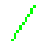

# Draw16

Draw16 is a fast graphic engine for retro games with very low screen resolution. It is made for games like from the **Super Nintendo** (Super Farmicom) or **DOS** era that use a 16 pixel grid. Draw16 is based on JavaScript and WebGL. The core is written in C++ and SDL, translated with emscripten.

## Why should I use it?

It is free, fast, simple and pixel perfect. Many modern game engines lack the ability of pixel precise drawing that is needed for retro games. Finding workarounds in order to get these graphics often results in performance issues.

Draw16 draws pixels, text, lines, rectangles, ellipses and chips (16x16 pixel textures). It supports full transparency for shadows, weather or water effects.

## Getting started

### Download or clone the git repository and run the demos

    git clone https://github.com/philipp-schwarz/draw16.git

Use Firefox for development. Or Chrome with the parameter --allow-file-access-from-files. Or use a webserver. Maybe... just use Firefox.

To get started quickly select a demo and edit it to your needs. Playing with functions and parameters might me easier than to read the whole documentation.

### The main structure explained

The library needs to be loaded inside of the ```<body>``` tag:

    <script type="text/javascript" src="../lib/Draw16.js"></script>

Init functions set up everything we need:

	Draw16.init(256, 240);
	Draw16.installFullscreen();

A callback function is called on every redraw:

	Draw16.onStep = function() {
		// Your application code goes here
	}

See *template.html* for a complete example.

## Drawing functions

**Draw16.color**(r, g, b) - convert RGB color to BGR, return it


**Draw16.drawPixel**(color, x, y) - draw color at x, y


**Draw16.drawLine**(color, x1, y1, x2, y1) - draw a colored line from x1, y1 to x2, y2


**Draw16.drawEllipse**(color, x, y, width, height) - draw a colored ellipse at x, y with width x height


**Draw16.drawEllipseFill**(color, x, y, width, height) - fill a colored ellipse at x, y with width x height


**Draw16.drawRectangle**(color, x, y, width, height) - draw a colored rectangle at x, y with width x height


**Draw16.drawRectangleFill**(color, x, y, width, height) - fill a colored rectangle at x, y with width x height

## Sprite drawing functions

**Draw16.drawChip**(texture, chipX, chipY, targetX, targetY) - draw a single 16x16 pixel chip from texture chipX, chipY at target x,y

**Draw16.drawArea** - draw an area of 16x16 pixel chips, multiple calls
**Draw16.drawArea**(texture, targetX, targetY) - draw the whole texture
**Draw16.drawArea**(texture, targetX, targetY, chipWidth, chipHeight) - set the width and heights by chips (16px)
**Draw16.drawArea**(texture, targetX, targetY, chipWidth, chipHeight, textureChipX, textureChipY, textureWidth, textureHeight) - select an area from the texture to repeat

## Text drawing functions

**Draw16.drawText8**(texture, font, color, text, x, y) - draw text at x, y using a texture, font and color
There can be more than one font in a texture. The default value for font is 0 and the default for bold text is 1.
All ASCII characters are supported. Special characters can be drawn using ^ right before the character. Edit font.png to add 

This part is under construction. Transparency, 16px height and monospace fonts are not available yet.

## Setup functions

**Draw16.init**(width, height) - Initialize Draw16 with width x height as screen resolution 
**Draw16.installFullscreen**() - Set the drawing area to fullscreen
**Draw16.loadTexture**(image) - Load an already loaded image as texture, return its id
**Draw16.loadTextureAsync**(name, src, cb) - Load an image from *src* as texture, *name* it and call *cb* as callback

## Parameters

**Draw16.ready** - read only, true if Draw16 is ready to use
**Draw16.fullscreen** - read only, true if Draw16 is installed in fullscreen mode

**Draw16.width** - read only, width of the screen resolution in pixel
**Draw16.height** - read only, height of the screen resolution in pixel

**Draw16.step** - read only, number of the frames rendered
**Draw16.fps** - number of the frames per second
**Draw16.fpsLast** - read only, frames rendered in the passed second

**Draw16.mouseHide** - set to true if you want to hide the cursor over the rendering area
**Draw16.mouseX** - read only, left position of the mouse cursor
**Draw16.mouseY** - read only, top position of the mouse cursor

**Draw16.texture** - read only, list of all loaded textures

## RPG Maker 2000 resources

It is not possible to just import RPG Maker resources yet. But with a little extra work you can use a lot of it.

**Character sets**
RPG Maker uses 24x32 pixel per character, but Draw16 only supports 16 pixel chips. Extend the image to 32x32 pixel per character animation frame and you are good to go.

**Chipsets**
Replace the background color with 100% transparency and you can use all chips from the set.
Animations are not supported, but you can show and hide chips time based (see Draw16.step) which ends in the same result.
Ground or water patterns are not supported.

**Other resources**
Face sets and all other graphics that use a 16 pixel grid are supported.

## Performance

If you use Draw16 wrong you will suffer with poor performance. There is no need to read the whole documentation, but you should read this:  

Always take care of the transparency in your chips / textures. This is key.

**No transparency - super fast**
Chips without transparency get a special boost and are drawn super fast. Make sure that not a single pixel in your sprite has transparency set, not even 1%!

**Full transparency - still fast**
When your sprite uses only full or no transparency, Draw16 still performs very well. Make sure to use only no (0%) or full (100%) transparency.

**50% transparency - okay**
When a pixel has 50% transparency (alpha 127/128) it will be processed faster, but not super fast.

**25% or 75% transparency - still okay**
When a pixel has 25% or 75% transparency (alpha 63/64, 191/192) it will be processed faster than fine transparency.

**Fine transparency - slow**
Fine transparency between 0% and 100% is slow. Keep that in mind. Use it when you really need it. Try to avoid it.

## Limits
If you need modern graphics, a screen resolution higher than 480x320, anti-aliasing, sprite rotation or fancy effects you should definitely consider using a game engine like pixi.js. I am not getting paid for saying that [pixi.js](http://www.pixijs.com/) is awesome! Give it a try. Just keep in mind that it is not optimized for low-res games.

## Do you like my work?
Share it. Tell me. Tell others. I would love to hear that my engine is used in production. You do not like it? Tell me why. I am realy willing to improve this project. Your feedback counts - thank you!
